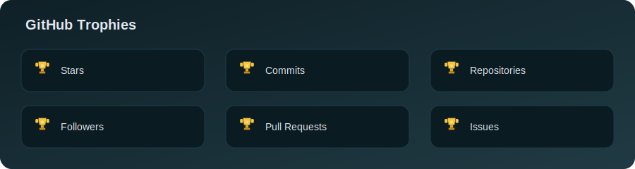

  

  <h1>Ankit Kaushik</h1>
  
<strong>App Developer | Competitive Programmer | Problem Solver</strong>

  
  

    
    
    
    
  

  

    
    
    
    
  

  
Phone: +91 7610527980

---

## Summary

- Build scalable software across mobile and web with clean architecture and performance focus
- Strong DSA background and competitive programming track record
- Proven impact on systems serving 10M+ users and 50M+ daily requests

---

## Education

- Indian Institute of Information Technology, Bhopal (Nov 2022 - May 2026)
  - B.Tech in Information Technology, CGPA 8.01
  - Relevant coursework: Data Structures and Algorithms, Object-Oriented Programming

---

## Professional Experience

### Agoda India Pvt Ltd - Software Development Intern (Jun 2025 - Present)
- Built 3 scalable backend services in Scala for Agoda's Affiliate Platform, cutting API response times by 40% and improving data flow for 50M+ daily partner integration requests
- Collaborated with a 5-member engineering team to design distributed system architecture, delivering 2 production-grade features serving 10M+ real-time user interactions daily with 99.9% uptime

### Sunrise Mentors Private Limited - Teaching Assistant Intern (May 2024 - Jul 2024)
- Provided one-on-one support to 200+ students, resolving complex C++ DSA issues through targeted debugging and concept clarification
- Guided students through challenging programming tasks, maintaining a 4.71/5 satisfaction rating

### Google Developer Student Club, IIIT Bhopal - Assistant App Dev Lead (Aug 2023 - Jul 2024)
- Led a 2-member app dev team as App Development Lead for the Google Developer Student Club

---

## Academic Projects

### CoinEquityX
**Links:** [Live Demo](https://coin-equity-x.vercel.app/) | [GitHub](https://github.com/ankit7610/CryptoCurrency)
**Tech:** React, TypeScript, Node.js, MongoDB, Firebase, Supabase, Gemini AI, Vitest, Docker, CI/CD
- Built a comprehensive investment tracking platform with real-time crypto and stock market data visualization using Recharts and a responsive Material UI design
- Integrated Firebase Authentication and Supabase for secure data management and an AI chat assistant using Google's Gemini API
- Implemented a high-performance caching layer using IndexedDB and TanStack Query, reducing API latency by 40% and enabling offline availability, validated with Vitest and Playwright

### BookLink App
**Links:** [GitHub](https://github.com/ankit7610/BookBridge)
**Tech:** Kotlin Multiplatform, Jetpack Compose, MVVM, Ktor 3.0, Room Database, Koin
- Developed a cross-platform book search app enabling searches across 10,000+ books
- Implemented adaptive navigation with genre and summary views for a personalized browsing experience
- Integrated Room Database for offline access and Koin for dependency injection to improve data retrieval efficiency

### Farmlytics
**Links:** [GitHub](https://github.com/ankit7610/FarmPrediction)
**Tech:** Python, Flask, TensorFlow, Keras, Scikit-learn, Docker, PWA, Bootstrap, NumPy, JavaScript
- Built an AI-powered agricultural intelligence platform with real-time crop disease detection for 9+ varieties
- Engineered CNN models for image-based diagnosis and integrated Scikit-learn for predictive soil analysis
- Added PWA features with Service Workers and IndexedDB for offline asset caching and local prediction history

---

## Achievements and Certificates

- Completed 1,800+ algorithmic challenges on LeetCode; Knight Badge in the top 2.86% globally with a peak rating of 1983 and best rank of 1003
- Achieved Expert rank on Codeforces with a peak rating of 1795; placed 422nd in a Div. 2 contest
- Earned a 5-star rating on CodeChef with a peak rating of 2064; ranked 12th globally in CodeChef Starters among 35,000+ participants
- Awarded a Certificate of Excellence in C++ DSA with a 95% score
- Solved 800+ competitive programming problems across platforms, earned 5-star proficiency in C++ on HackerRank, and completed 500+ DSA problems on Code360

---

## Skills

- Languages: C, C++, Python, Java, Swift, Kotlin, Scala, JavaScript, TypeScript, Dart, MATLAB
- Mobile: SwiftUI, Jetpack Compose, Flutter, React Native
- Backend and Data: Node.js, Express, MongoDB, MySQL, Firebase, GraphQL
- Tools: Git, GitHub, GitLab, Docker, Xcode, Android Studio, VS Code, IntelliJ, DataGrip, Postman, Grafana, Linux
- Soft Skills: Leadership, Team Management, Creativity, Public Speaking

---

## GitHub Highlights

  
  

  

  

  <a href="https://github.com/ankit7610?tab=achievements">View GitHub Achievements</a>

---

  

